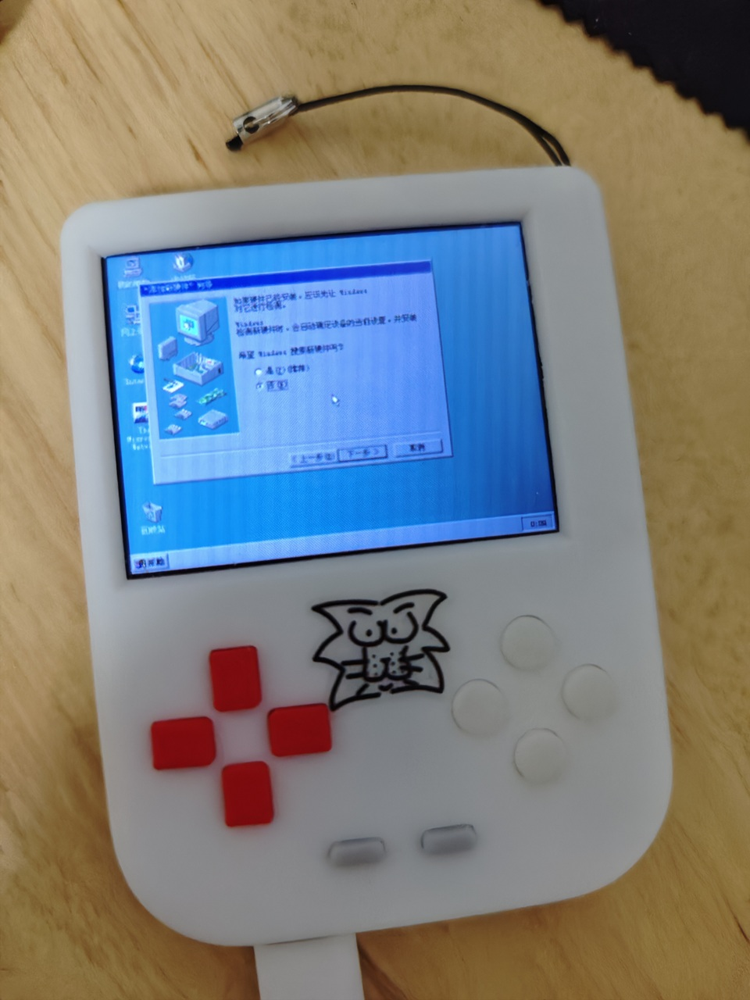
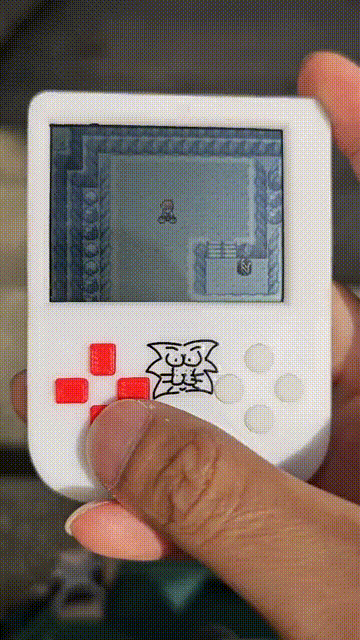

# retro-game-lionstdio
a retro games console 

# Brief introduction:
## firmware based on retro-go integrated gba, dos simulator. add wired netplay, video player.
- 
- 
- 
- 
## hw use ili9342 drive 2.4 inch half transparent tft display, powered by esp32s3/p4

## 3d print case without screw

# Notice:
- ec gudie refer to [PCB_EC](pcb/README.md#ec)
- manufacture and assemble gudie refer to [PCB_MANUFACTURE](pcb/README.md#manufacture) [3D_PRINT_MANUFACTURE](case/README.md#manufacture) [ASSEMBLING](case/README.md#assemble)
- firmware flash and develop gudie refer to [FLASHING](pcb/README.md#flashing) [BUILDING](pcb/README.md#building)

# Final product:

# License
Everything in this project is licensed under the [GPLv2 license](COPYING)